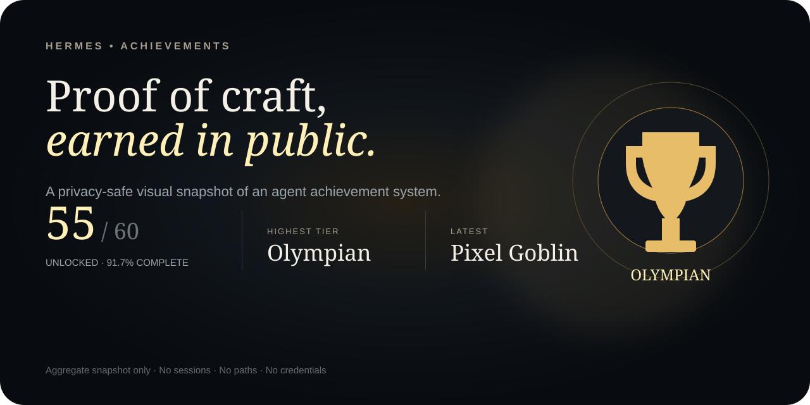

# Hermes Achievements

[](index.html)
[](data/snapshot.json)
[](#privacy)
[](LICENSE)

[](https://shinjaehyun20.github.io/hermes-achievements/)

**A public-safe visual snapshot of an agent achievement system.** It turns aggregate progress—56 of 60 unlocked, Olympian tier, latest unlock Vibe Architect—into a responsive portfolio story without publishing private activity history.

**[Open the live showcase](https://shinjaehyun20.github.io/hermes-achievements/)** · [Inspect the snapshot](data/snapshot.json) · [Read the security policy](SECURITY.md)

## What it demonstrates

| Surface | Demonstration |
| --- | --- |
| Product storytelling | Progress is framed as Explore → Build → Verify → Master, not a raw badge dump. |
| Visual system | Trophy mark, tier colors, badge cards, progress metrics, and editorial typography. |
| Privacy engineering | Only aggregate counts and two public-safe labels are shipped. |
| Frontend craft | Dependency-free HTML/CSS/JS, responsive states, reduced-motion support, semantic landmarks. |

## Architecture

```text
index.html              semantic landing page
styles.css              responsive trophy and badge system
app.js                  snapshot metadata hydration
data/snapshot.json      sanitized aggregate source
assets/                 GitHub-safe SVG hero and trophy mark
```

GitHub Pages can serve the repository root directly. No build step or external runtime is required.

## Data provenance

The snapshot was manually reduced from a locally running Hermes achievements page on 2026-07-15. It includes only:

- 56 unlocked out of 60 total
- 4 visible achievements remaining
- highest tier: `Olympian`
- latest unlock: `Vibe Architect`
- zero secret achievement metadata published

The site does not connect to a live Hermes instance.

## Privacy

This is not an export of session history. The public bundle excludes session titles, prompts, local paths, usernames, raw evidence, tokens, private achievement descriptions, and runtime configuration. See [`data/snapshot.json`](data/snapshot.json) for the full published data boundary.

## Run and verify

```bash
python -m http.server 8000
# open http://127.0.0.1:8000

python -m json.tool data/snapshot.json
```

Verification should check desktop and mobile layouts, browser console errors, all relative assets, JSON parsing, and a public-safety/secret scan before publication.
